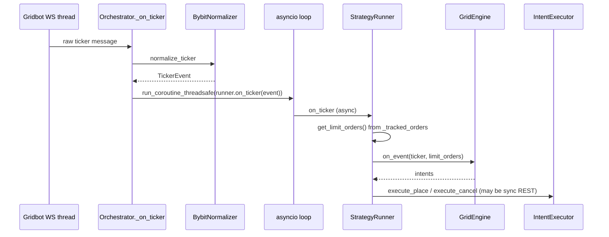

# Gridbot + embedded EventSaver: architecture and debugging

This guide matches a run like:

```bash
uv run python -m gridbot.main \
  --config /Users/erzhan/DATA/PROJ/grid-bot-validation/conf/gridbot_test.yaml \
  --save-events \
  --debug
```

**Important:** the flag is `--save-events` (with a trailing `s`). `--save-event` will be rejected by argparse.

`conf/gridbot_test.yaml` may already set `enable_event_saver: true`; `--save-events` still forces capture on even if YAML had `false`.

---

## 1. Two parallel pipelines

| Pipeline | Role | Main code |
|----------|------|-----------|
| **Trading** | Grid logic, limits, cancels | `Orchestrator` → `StrategyRunner` → `GridEngine` → `IntentExecutor` |
| **Event capture** | Persist tickers, trades, private streams to DB | `EventSaver` → collectors → writers → DB |

They **do not share one WebSocket**: gridbot and EventSaver each use their own clients. That is intentional so “raw” streams can be recorded independently of trading normalization.

---

## 2. Startup order (actual `Orchestrator.start`)

This order matters when you ask “why X before Y”:

1. `_init_account` / `_init_strategy` — REST clients, executors, reconcilers, `StrategyRunner`.
2. `_build_routing_maps` — `symbol → runners`, `account → runners`.
3. **Per runner:** `reconcile_startup` (REST `get_open_orders`) → `runner.inject_open_orders(...)`.
4. `_create_run_records` — User / BybitAccount / Strategy / Run rows in DB; fills `_run_ids`.
5. If `enable_event_saver` and `db` exists: **`_start_event_saver`** → `EventSaver.start()` (public + private collectors, writers).
6. **`_connect_websockets`** — `public.connect()` + `private.connect()` for gridbot.
7. `_fetch_and_update_positions(startup=True)`.
8. Background tasks: position check, health, **order sync** (periodic `reconcile_reconnect`), retry queues.

EventSaver starts **before** gridbot WS connect to shrink the window where events arrive but capture is not up yet.

---

## 3. What is async and what is not (the usual debugging confusion)

### 3.1. One shared `asyncio` event loop

`gridbot.main` uses `asyncio.run(main(...))`. Inside:

- `await orchestrator.start()` runs **in that loop**.
- `StrategyRunner.on_ticker` / `on_execution` / `on_order_update` are **`async def`** and are **`await`ed** from tasks scheduled on that loop.

### 3.2. WebSocket callbacks run on another thread

In `Orchestrator`, `_on_ticker`, `_on_order`, and `_on_execution` are **synchronous**. They are invoked from the WS client thread (pybit), not from the asyncio loop.

Then the handoff into the loop is:

```text
WS thread → normalizer → asyncio.run_coroutine_threadsafe(runner.on_*(event), self._event_loop)
```

Debugging implications:

- A breakpoint in `_on_ticker` hits in the **WS thread**.
- A breakpoint in `runner.on_ticker` hits in the **asyncio loop** (when the coroutine actually runs).
- There is **small latency** between the two; ordering vs other events can look “fuzzy”.

### 3.3. EventSaver — same pattern

In `EventSaver`, private/public WS callbacks use `run_coroutine_threadsafe` into writers. So: **seeing an event in a handler ≠ row already in DB** — buffer first, then flush.

### 3.4. Synchronous REST and Ctrl+C

`gridbot.main` notes that a second Ctrl+C calls `os._exit` because **sync REST can block the loop** and delay graceful shutdown. Do not be surprised if shutdown “hangs” on REST while debugging.

---

## 4. Object diagram (Mermaid)

```mermaid
flowchart TB
  subgraph Main["gridbot process (asyncio loop)"]
    MAIN["gridbot.main → Orchestrator.start/stop"]
    RUN["StrategyRunner\n(tracked orders, risk, execute)"]
    ENG["GridEngine\n(intents only, no I/O)"]
    EXE["IntentExecutor\nREST place/cancel"]
    REC["Reconciler\nREST open orders"]
  end

  subgraph WSGrid["Gridbot WebSocket (client thread)"]
    PUB["PublicWebSocketClient"]
    PRV["PrivateWebSocketClient"]
  end

  subgraph ES["EventSaver (same process, loop ref + collectors)"]
    ESC["EventSaver"]
    PC["PublicCollector"]
    PRC["PrivateCollector(s)"]
    W["Writers → DB"]
  end

  DB[("Database")]

  MAIN --> RUN
  RUN --> ENG
  RUN --> EXE
  MAIN --> REC
  REC --> RUN

  PUB -->|callbacks| MAIN
  PRV -->|callbacks| MAIN
  MAIN -->|run_coroutine_threadsafe| RUN

  ESC --> PC
  ESC --> PRC
  PC --> ESC
  PRC --> ESC
  ESC --> W W --> DB

  MAIN -->|embedded start| ESC EXE -->|REST| X[(Bybit REST)]
  PUB --> X  PRV --> X
```

---

## 5. Typical path: ticker → intents → exchange



---

## 6. Step-through debugging checklist

Work **top to bottom** once at startup, then one event at a time.

### 6.1. IDE setup

- Use the **same** interpreter as `uv` (`uv run` or `.venv`).
- Show **thread name** in the debugger (helps separate WS thread from MainThread).

### 6.2. Process startup (breakpoints)

| Step | Location | Inspect |
|------|----------|---------|
| 1 | `gridbot.main:main` after `load_config` | `config.enable_event_saver`, `database_url`, strategy list |
| 2 | Start of `Orchestrator.start` | `_running`, accounts/strategies initialized |
| 3 | `Reconciler.reconcile_startup` → `runner.inject_open_orders` | Open orders from exchange; after inject `runner.get_tracked_order_count()` |
| 4 | `Orchestrator._create_run_records` | Run rows in DB; `_run_ids[strat_id]` populated |
| 5 | `Orchestrator._start_event_saver` | Log `EventSaver started`; with **one** strategy per account, `run_id` on `AccountContext` matches that strategy’s run |
| 6 | `Orchestrator._connect_websockets` | Both `connect()` calls run |

**Without a debugger:** logs should mention reconciliation complete, EventSaver started, Connected WebSockets.

### 6.3. First ticker

| Step | Breakpoint | Inspect |
|------|------------|---------|
| A | `Orchestrator._on_ticker` | `symbol`; `normalize_ticker` not `None` |
| B | `StrategyRunner.on_ticker` | `event.last_price`, `get_limit_orders()` vs expectations after inject |
| C | `GridEngine.on_event` (ticker path) | `intents` (place/cancel) |
| D | `StrategyRunner._execute_place_intent` / cancel path | Whether it runs; `shadow_mode` in config |

### 6.4. Execution / order update

| Step | Breakpoint | Inspect |
|------|------------|---------|
| A | `Orchestrator._on_execution` / `_on_order` | Normalized `event`, symbol |
| B | `StrategyRunner._find_tracked_order` | Match by `order_link_id` or `order_id` |
| C | `GridEngine.on_event` (execution/order) | New intents after a fill |

### 6.5. EventSaver alone

| Step | Breakpoint | Inspect |
|------|------------|---------|
| A | `event_saver.main.EventSaver._handle_ticker` (etc.) | Event received; `run_coroutine_threadsafe` scheduled |
| B | Matching `*Writer.write` | Row enters buffer |
| C | `EventSaver.stop` | Writers flush |

If logs warned about **`run_id=None`** when adding an account, executions/orders may **not be persisted** (see `EventSaver.add_account`). For `gridbot_test.yaml` with **one** strategy per account, `run_id` is usually set correctly.

---

## 7. Quick self-check questions

After one run with breakpoints you should be able to answer:

1. After startup, did `inject_open_orders` fill `_tracked_orders` from the exchange?
2. Does the **first ticker** see the same limits via `get_limit_orders()` that the engine uses?
3. Which **thread** was the WS callback on, and which **loop task** ran `on_ticker`?
4. Did **EventSaver** see a ticker/trade even when the trading path did something else?
5. The **order sync loop** (background) calls `reconcile_reconnect` — do not confuse it with startup reconciliation.

---

## 8. Related files

- `apps/gridbot/src/gridbot/main.py` — CLI, `--save-events`, `--debug`, `asyncio.run`.
- `apps/gridbot/src/gridbot/orchestrator.py` — startup order, WS callbacks, `run_coroutine_threadsafe`, embedded EventSaver.
- `apps/gridbot/src/gridbot/runner.py` — `on_ticker` / `on_execution` / `inject_open_orders`.
- `packages/gridcore/src/gridcore/engine.py` — intent generation, `outside_grid` / `side_mismatch`.
- `apps/event_saver/src/event_saver/main.py` — EventSaver lifecycle and handlers.
- `conf/gridbot_test.yaml` — example test config.

Root `RULES.md` section **Embedded EventSaver (`--save-events`)** covers `run_id` and multi-strategy caveats.
